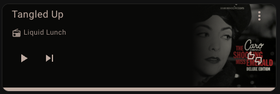
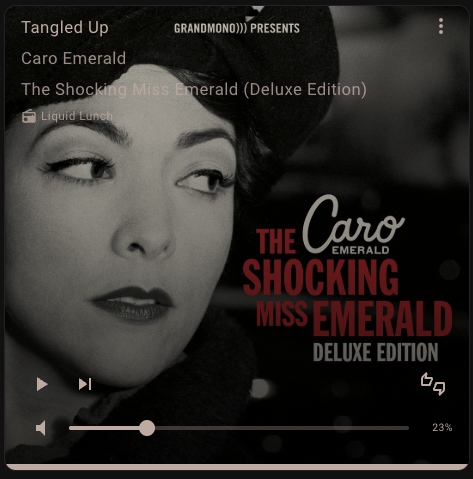
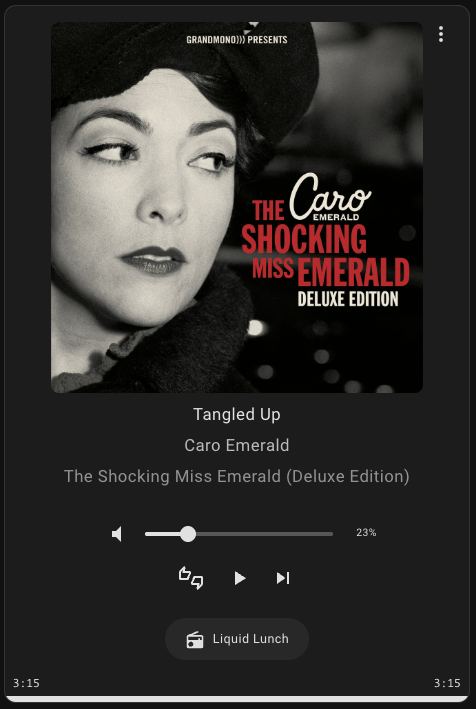

# Pianobar Media Player Card

[](https://github.com/hacs/integration)
[](https://github.com/mr-light-show/pianobar-media-player-card/releases)
[](https://github.com/mr-light-show/pianobar-media-player-card/actions)

A custom Home Assistant Lovelace card for the [pianobar-ha](https://github.com/khawes/pianobar-ha) media player integration with pandora station management support.

## Screenshots

| Default | Full | Minimal | Tall |
|---------|------|---------|------|
|  |  |  |  |

## Features

- Thumbs up / down / snooze (tired) song actions
- Volume control override to a different media player
- Multiple artwork display modes
- Configurable preset modes

## Installation

### HACS (Recommended)

1. Open HACS in Home Assistant
2. Click on "Frontend"
3. Click the three dots menu and select "Custom repositories"
4. Add this repository URL and select "Lovelace" as the category
5. Install "Pianobar Media Player Card"
6. Reload your browser

### Manual Installation

1. Download `pianobar-media-player-card.js` from the [releases page](https://github.com/khawes/remote_pianobar_card/releases)
2. Copy it to your `config/www/` directory
3. Add the resource in your Lovelace configuration:

```yaml
resources:
  - url: /local/pianobar-media-player-card.js
    type: module
```

## Configuration

### Quick Setup with Preset Modes

```yaml
type: custom:pianobar-media-player-card
entity: media_player.pianobar
mode: default  # default, full, minimal, or custom
```

### Mode Comparison

| Mode | Artwork | Volume | Song Actions | Progress | Best For |
|------|---------|--------|--------------|----------|----------|
| **Default** | Right thumbnail | Visible | Visible | Visible | Standard use |
| **Full** | Full-cover background | Visible | Visible | Visible | Visual focus |
| **Minimal** | Right thumbnail | Hidden | Hidden | Hidden | Compact dashboards |
| **Custom** | Your choice | Your choice | Your choice | Your choice | Power users |

### Custom Mode with Full Control

```yaml
type: custom:pianobar-media-player-card
entity: media_player.pianobar
mode: custom
artwork: full-cover          # default (right thumbnail) or full-cover
showVolumeControl: true
showSongActions: true
showProgressBar: true
showPlaybackControls: true
volume_entity: media_player.living_room_speaker  # optional - volume on different player
```

### Configuration Options

| Option | Type | Default | Description |
|--------|------|---------|-------------|
| `entity` | string | **Required** | The Pianobar media player entity ID |
| `mode` | string | `default` | Preset mode: `default`, `full`, `minimal`, or `custom` |
| `artwork` | string | `default` | Artwork display: `default` (thumbnail right) or `full-cover` |
| `showVolumeControl` | boolean | `true` | Show volume slider (custom mode only) |
| `showSongActions` | boolean | `true` | Show thumbs up/down/snooze button (custom mode only) |
| `showProgressBar` | boolean | `true` | Show playback progress bar (custom mode only) |
| `showPlaybackControls` | boolean | `true` | Show play/pause and next buttons (custom mode only) |
| `volume_entity` | string | - | Override volume control to a different media player |
| `name` | string | - | Custom display name for the card |

### Volume Control Override

The `volume_entity` option allows you to control volume on a different media player while playback controls still target the Pianobar entity. This is useful when Pianobar plays through an external speaker:

```yaml
type: custom:pianobar-media-player-card
entity: media_player.pianobar
volume_entity: media_player.sonos_living_room
```

## Song Actions

The card provides a popup menu for Pandora song actions:

- **Love Song** (thumbs up) - Tells Pandora you like this song
- **Ban Song** (thumbs down) - Removes the song from the station
- **Snooze (1 month)** - Temporarily skips the song for 1 month

These actions call the corresponding services from the pianobar-ha integration:
- `pianobar.love_song`
- `pianobar.ban_song`
- `pianobar.tired_of_song`

## Development

### Building

```bash
# Install dependencies
npm install

# Build for production
npm run build

# Development mode with watch
npm run watch
```

### Local Deploy to Home Assistant

The project includes a deploy script that copies the built card to your Home Assistant server via SSH and generates a cache-busting version number.

**Setup:**

1. Configure your HA connection (edit `scripts/deploy.sh` or use environment variables):
   ```bash
   export HA_HOST="homeassistant.local"  # Your HA hostname or IP
   export HA_USER="root"                  # SSH user
   export HA_WWW_PATH="/config/www"       # www directory path
   ```

2. Ensure SSH access to your Home Assistant server is configured

**Deploy:**

```bash
# Build and deploy in one command
npm run deploy
```

The script will:
1. Build the card
2. Copy to your HA server via `scp`
3. Output a resource URL with a cache-busting timestamp

**Add to Lovelace:**

After deploying, add the resource in Home Assistant:
1. Go to Settings → Dashboards → ⋮ (three dots) → Resources
2. Add Resource:
   - URL: `/local/pianobar-media-player-card.js?v=<timestamp>` (use the URL from deploy output)
   - Type: JavaScript Module
3. Hard refresh your browser (`Cmd+Shift+R` / `Ctrl+Shift+R`)

**Tip:** After each deploy, update the `?v=` parameter to the new timestamp to bust the browser cache.

## License

MIT License - see LICENSE file for details.

